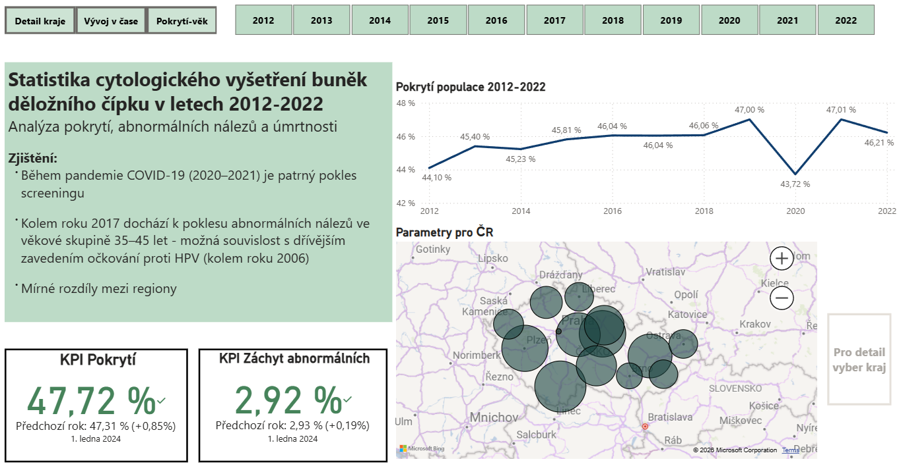

# Cervical Cancer Screening Analysis (Czech Republic)

In this project, I worked with publicly available data about cervical cancer screening in the Czech Republic.

The dataset covers years 2012–2022 and includes over 100k records. I focused mainly on screening coverage, abnormal findings, and mortality, and how these differ across regions and age groups.

I wanted to try working with real-world healthcare data and go through the whole process – from raw data to a final dashboard.

## Working with data

* Cleaning and transforming data in MySQL (JOINs, GROUP BY, VIEW, etc.)
* Building a data model and basic DAX calculations in Power BI
* Creating an interactive dashboard in Power BI

## Insights

* There is a visible drop in screening during COVID (2020–2021), which is expected, but still clearly visible in the data
* Around 2017, there is a decrease in abnormal findings in the 35–45 age group
* This might be related to HPV vaccination introduced earlier (around 2006), but this would need deeper analysis
* There are also noticeable differences between regions

## Dashboard

I created an interactive dashboard in Power BI that shows:

* screening coverage over time
* abnormal findings
* mortality trends
* regional comparison
The dashboard is designed to provide a quick overview of trends and allow basic exploration of the data.

## Open questions

I am interested in how these trends develop in the future, especially as cohorts vaccinated at ages 13–14 (both girls and boys) reach higher-risk age groups.

This could provide more insight into the long-term impact of HPV vaccination on abnormal findings and screening outcomes.

